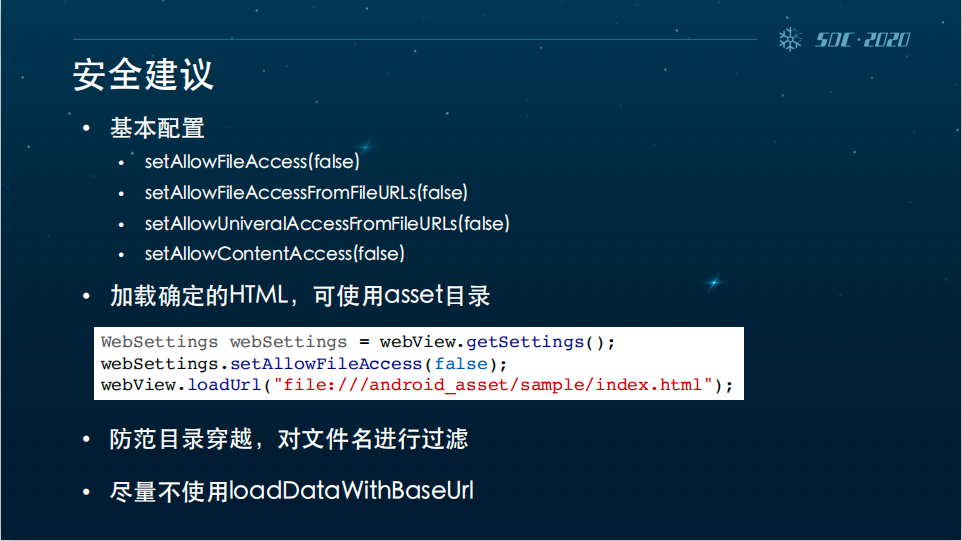
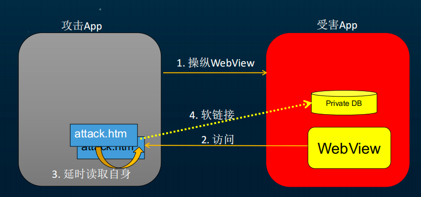
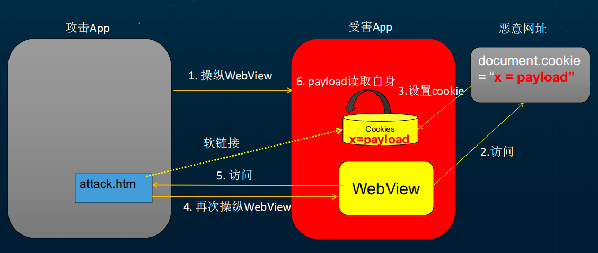
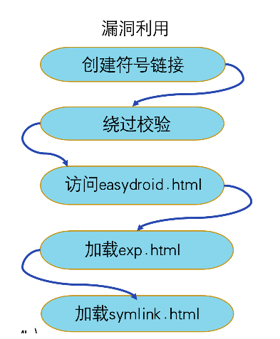
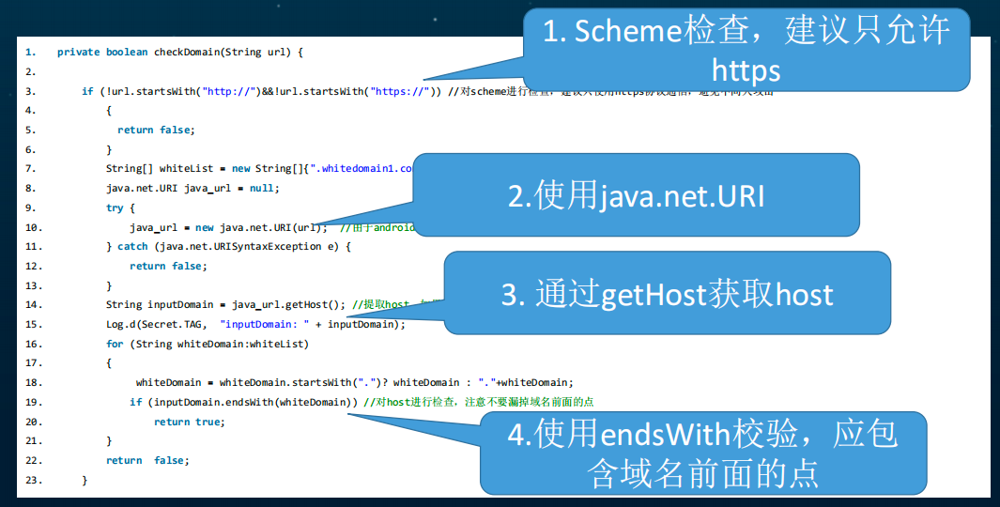

#### webview漏洞

* 明文存储密码 **mWebView.setSavePassword(true)**
* File同源策略绕过漏洞
* 绕过证书漏洞
  [Android WebView安全攻防指南2020](https://zhuanlan.kanxue.com/article-14155.htm)
* 

#### 历史漏洞

* 任意代码执行漏洞
* 明文存储漏洞

#### 跨域漏洞

* setAllowFileAccess()
    * 允许访问本地html文件
* setAllowFileAccessFromFileUrls()
    * 否允许通过file url加载的Javascript读取其他的本地文件
* setAllowUniversalFileAccessFromFileUrls()
    * 设置是否允许通过file url加载的Javascript可以访问其他的源，包括其他的文件和http,https等其他的源
* 通过符号链接和延时加载来产生此漏洞
    * 通过file跨域：直接读取（访问）本地文件来产生此漏洞
    * 通过绕过file协议的同源检查：符号链接和延时加载来产生此漏洞。

### 漏洞防御策略

* 检查应用是否使用了 webview 控件；
* 避免 App 内部的 WebView 被不信任的第三方调用，排查内置 WebView 的 Activity 是否被导出、必须导出的 Activity 是否会通过参数传递调起内置的WebView等；
* file 域访问为非功能需求时，手动配置 setAllowFileAccessFromFileURLs 或 setAllowUniversalAccessFromFileURLs 两个 API 为
  false（Android 4.1 版本之前这两个 API 默认是 true，需要显式设置为 false）； 若需要开启 file 域访问，则设置 file 路径的白名单，严格控制 file
  域的访问范围，具体如下：

    * 固定不变的 HTML 文件可以放在 assets 或 res 目录下，file:///android_asset 和 file:///android_res 在不开启 API
      的情况下也可以访问；
    * 可能会更新的 HTML 文件放在 **/data/data/(app) 目录下**，避免被第三方替换或修改；
    * 对 file 域请求做白名单限制时，**需要对“…/…/”特殊情况进行处理**，避免白名单被绕过。

##### 最终解决方案总结

##### 禁用 file 协议；
  ```java
    setAllowFileAccess(false);
    setAllowFileAccessFromFileURLs(false);
    setAllowUniversalAccessFromFileURLs(false);
```

##### 于需要使用 file 协议的应用，禁止 file 协议加载 JavaScript：

```java
// 需要使用 file 协议时
setAllowFileAccess(true);
        // 禁止 file 协议加载 JavaScript
        if(url.startsWith("file://"){
        setJavaScriptEnabled(false);
        }else{
        setJavaScriptEnabled(true);
        }

```

#### URL配置漏洞

* 常见的URL绕过漏洞
* URL Scheme 绕过漏洞
* hearachical Uri绕过漏洞
* [shouldOverrideUrlLoading 跳转漏洞](https://www.freebuf.com/articles/terminal/201407.html)
    * 在shouldOverrideUrlLoading 中，再次做url白名单校验
* 重要提醒：建议只使用https协议通信，避免中间人攻击
* 不要使用indexOf这种模糊匹配的函数；
* 不要自己写正则表达式去匹配；
* 尽量使用Java封装好的获取域名的方法，**比如java.net.URI**，不要使用java.net.URL；
* **不仅要给域名设置白名单，还要给协议设置白名单**，一般常用HTTP和HTTPS两种协议，不过强烈建议不要使用HTTP协议，
  因为移动互联网时代，手机被中间人攻击的门槛很低，搭一个恶意WiFi即可劫持手机网络流量；
* 权限最小化原则，**尽量使用更精确的域名或者路径**

#### 特殊接口

* Intent 重定向的launchAnyWhere 漏洞
* DeepLink
    * deeplink 任意代码执行漏洞
    * deeplink XSS注入漏洞
* loadWithBaseURL 任意域的XSS 注入漏洞

|方法 |作用风险 |默认策略|
|---|---|---|
setAllowFileAccess(true);| 设置是否允许 WebView 使用 File 协议|默认设置为 true|
setAllowFileAccessFromFileURLs(true);| 设置是否允许通过 file url 加载的 Js 代码读取其他的本地文件|在 Android 4.1 后默认禁止
setAllowUniversalAccessFromFileURLs(true);| 设置是否允许通过 file url 加载的 Javascript 可以访问其他的源 (包括http、https等源)|在 Android 4.1 后默认禁止
setJavaScriptEnabled(true);| 设置是否允许 WebView 使用 JavaScript|默认不允许

* 任意文件窃取（应用克隆漏洞）
    * setAllowFileAccess(true) + setAllowFileAccessFromFileURLs(true)
* 通用协议漏洞 （恶意页面注入）
* setAllowFileAccess(true) + setAllowUniversalAccessFromFileURLs(true)

#### 安全防护

* 检查应用是否使用了 webview 控件；
* 避免 App 内部的 WebView 被不信任的第三方调用，排查内置 WebView 的 Activity 是否被导出、必须导出的 Activity 是否会通过参数传递调起内置的WebView等；
* file 域访问为非功能需求时，手动配置 **setAllowFileAccessFromFileURLs** 或 **setAllowUniversalAccessFromFileURLs**
  两个 API 为 false （Android 4.1 版本之前这两个 API 默认是 true，需要显式设置为 false
* 若需要开启 file 域访问，则设置 file 路径的白名单，严格控制 file 域的访问范围
    * 固定不变的 HTML 文件可以放在 assets 或 res 目录下，file:///android_asset 和 file:///android_res 在不开启 API
      的情况下也可以访问；
    * 可能会更新的 HTML 文件放在 /data/data/(app) 目录下，避免被第三方替换或修改；
    * 对 file 域请求做白名单限制时，需要对“…/…/”特殊情况进行处理，避免白名单被绕过。

### 符号链接跨源攻击



* 在该命令执行前 xx.html 是不存在的；执行完这条命令之后，就生成了这个文件，并且将 Cookie 文件链接到了 xx.html 上。）
    *
        1. 把恶意的 js 代码输出到攻击应用的目录下，随机命名为 xx.html，修改该目录的权限；\
    *
        1. 修改后休眠 1s，让文件操作完成；\
    *
        2. 完成后通过系统的 Chrome 应用去打开该 xx.html 文件\
    *
        3. 等待 4s 让 Chrome 加载完成该 html，最后将该 html 删除，并且使用 ln -s 命令为 Chrome 的 Cookie 文件创建软连接，\
           于是就可通过链接来访问 Chrome 的 Cookie

* 安全防护
    *
  设置setAllowFileAccess方法为false,设置setAllowFileAccessFromFileURLs和setAllowUniversalAccessFromFileURLs为false。
    * 在Android4.0(API15)及以下得采用其他方法进行手动校验是否访问file域
    * 当WebView所在Activity存在组件暴露时，若不是必要的组件暴露，应该禁止组件暴露

### 污染Cooike漏洞



* 漏洞原理
    * 1:攻击者创造符号链接，
    * 2: 然后绕过校验，访问攻击的html，
    * 3：再通过软链接去加载symlink.html，
    * 4： 然后窃取Cooike，如下图所示：
    * 

### URL配置漏洞

* 漏洞原理：

```java
if(url.startsWith("file://")){
        setJavaScriptEnbled(false);
        }else{
        setJavaScriptEnbled(true);
        }
```

* 绕过写法

```java
(1)大写字母 “File://”
        (2)前面加上空格： “ file://”
        (3)字符编码：“file：%2F/”
        (4)可正常访问的畸形路径：“file:sdcard/attack/html” 或 “file:/\//sdcard/attack.html”
```

* 修复方法
* 对于不需要使用file协议的应用，禁用file协议
* 对于需要使用file协议的应用，禁止file协议调用javascript
* 将不必要导出的组件设置为不导出

* 常见的url校验

```java
if(host.endsWith("mysite.com")){
        enableJavascriptInterface();
        }
 ```

* 修复 **.前面是一个点**
* endsWith(".mysite.com") // 前面是一个点

### 安全防护

* 
* 在shouldOverrideUrlLoading函数中拦截跳转，并对跳转的Url进行检查;
*

参考[Android：访问受应用程序保护的组件](https://blog.oversecured.com/Android-Access-to-app-protected-components/#access-to-arbitrary-components-via-webview)

### file协议绕过

### deeplink + webview 漏洞

* [APP漏洞利用组合拳——应用克隆案例分析](http://blog.nsfocus.net/app-vulnerability-exploitation-combination-boxing/)
* [危险的deeplink](https://mp.weixin.qq.com/s/81Lq-JwASnkSS2wg62HSvA?)

* 设置activity不可被导出
* 禁止WebView 使用 File 协议，而且是明确禁止

-----

### scheme deeplink引入的安全问题。

#### 1. 通过deeplink操纵WebView

#### 2. 通过deeplink构造 CSRF

#### 3. 通过deeplink绕过应用锁

#### 4. 通过deeplink打开App保护组件

*（1）多个deeplink控制WebView url跳转指定网址，只能用来phishing；
*（2）两个deeplink可以打开ReactNativeWebView且支持file://；
*（3）一个deeplink可以打开WebView并携带重要的oauth_token泄露到攻击者指定的链接；
*（4）两个deeplink分别能启动app调试、停止app调试并在不安全的外部存储生成profile文件

### deeplink的收集

### 由于deeplink无法验证来源

* 发送携带认证token的数据包

* 打开保护组件

* 绕过应用锁

* 无需用户交互对外拨号

* 静默安装应用

> 建议使用deeplink的App开发者向内部安全团队提供所有deeplink清单和设计文档进行安全测试，
> 这样可以比外部攻击者更早、更全面地发现deeplink引入的安全问题。

   

